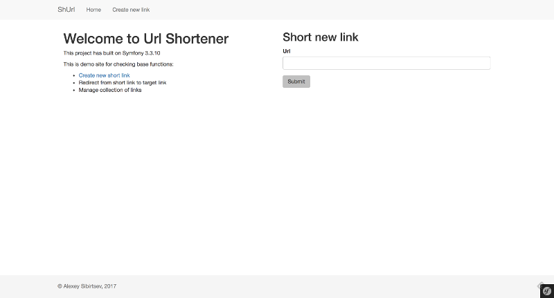
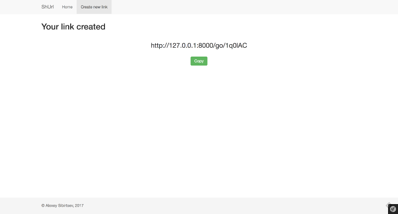
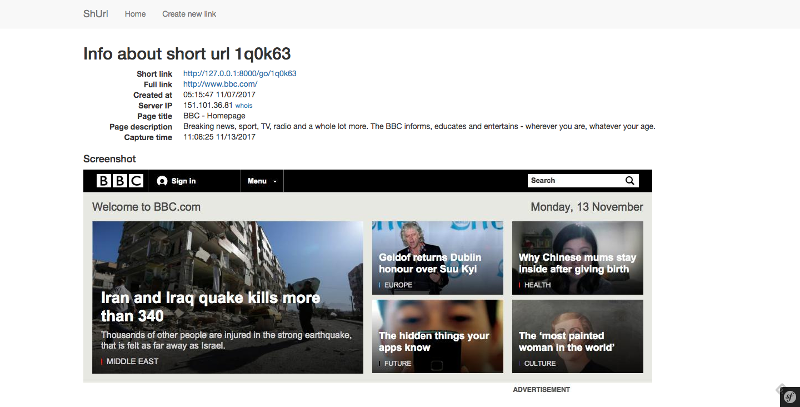
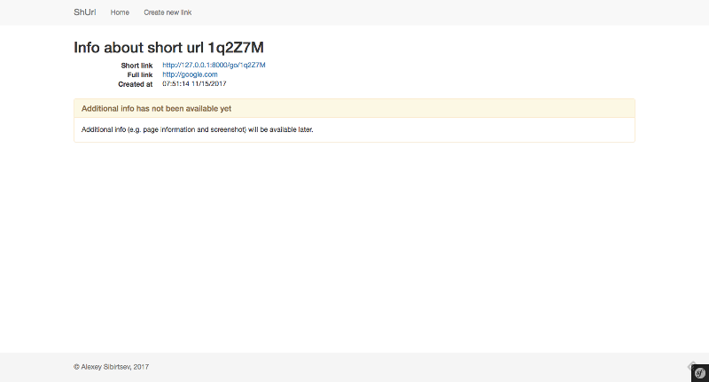

URL Shortener
=========

Simple URL Shortener based on Symfony framework

## Requirements
* PhantomJS - Download binary of phantomjs and put it into `bin` folder of application or create symlink to it

## Installation
1. Install dependencies via comporer `composer install`
2. Install `yarn`
3. Install dependencies via yarn `yarn install`
4. Install build frontend bundles with `yarn run encore dev` for development or `yarn run encore production` for production
5. Apply migrations `bin/console doctrine:migrations:migrate` 
6. Add cron-task for info service `url:get-info` with `bin/console cron:create`
7. Add line `* * * * * /path/to/application/app/console cron:run 1>> /dev/null 2>&1` to your `crontab` on server
8. Run server `bin/console server:start`

## ToDo List
- [x] Simple form for add new url
- [x] Redirect location
- [x] Info location
- [ ] Authorization [FOSUserBundle]
- [ ] User Control panel
- [ ] RESTapi
- [ ] Update Hash algorithm (get rid of collisions)

## Screenshots
### Home Page

### Short link

### Info Page

#### Info Page without additional info
